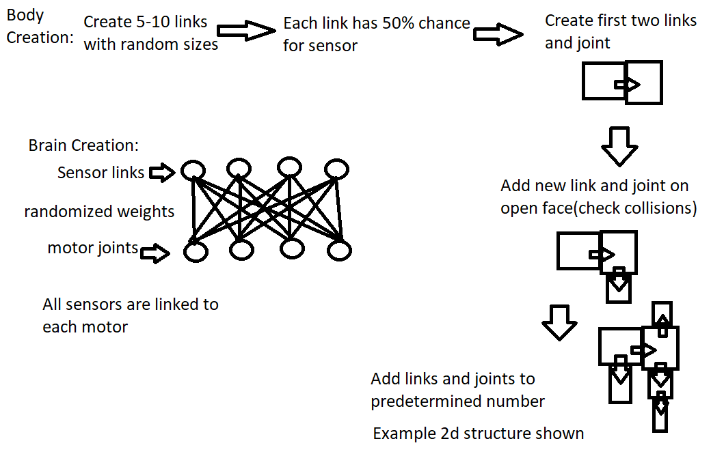
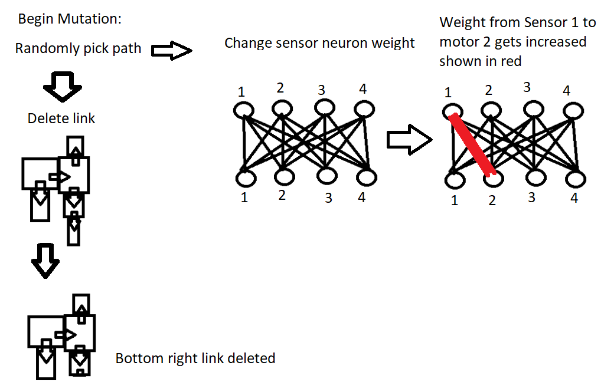

# Running Code
repository for Ludobots Assignment 8
Jeffrey He

Download all the files, and run main.py
At the command line: python3 main.py

# Videos

Short video: LINK

2 minute video: LINK

# Methods
The simulation works through parallel hill climbing. Multiple robots are being modified simultaneously through creation, mutation, and selection. The image below shows a detailed version of robot creation.

ROBOT CREATION

First, the robot parameters are initiated with random number of links between 5-10. Each link has randomized size predetermined along with a 50% chance to be a sensor link. Then, the first 2 links and first joint are created manually, but still random. Next, every iteration a new link and joint gets attached to the previous robot. The code checks for self collision and only allows new links on outside faces. After all the links and joints are created, it gets formed and pyrosim ends.

For the brain, these are generated from mapping sensors to motors. Each sensor has a weight to a motor which can be changed later on to effect movement. 

After creation, each robot undergoes a mutation at each generation shown in the image below.

There are two possible mutations: either deleting an existing link, or changing a weight. Deleting a link removes an outside link and the joint attached to it. These only apply to the very outside link otherwise the robot breaks down. Changing the weight is done by changing a certain weight randomly in the array.

After mutation, the robot gets compared to its predecessor through selection and evolution shown below. 

SELECTION PICTURE

SELECTION DESCRIPTION

# CODE OVERVIEW

code description

# Results

Results description

Fitness Diagram:
A population size of 5 was chosen with number of generations of 150. The fitness level is denoted by the +x position given. The higher the better, and the kept children are the ones that go further in the +x direction.

Mutation:
50% chance to change a sensor motor for a new child.
50% chance to add a link on the outside of the current robot for a new child.
The fitness of child and parent are compared, larger is kept for future iterations.

Body generation:
A random amount of links gets generated between 5-15.
Each link can is randomly chosen to be a sensor with a 50% probability.
Each link has its x,y,z dimensions stored in a dictionary randomly between 0.2 and 1.2.

For each new link, it creates a joint between a randomly selected old link. Then a randomly selected available face is selected on that link.

The code checks if there is a possible face for the link, and then collision detection is run so that the new link does not exist in the same space as an old link.

When creating a new link and joint, previous link information is used to create the new joint position in joint_maker and the code iterates over every new link and then end pyrosim.

Brain Generation:
Use stored variables to create sensors for the appropriate links, and generate motors off the list of joints created in body generation.

The weights for the sensors and motors are chosen at random as well.

The creature fills 3d space by having the option to produce multiple links off the same link instead of one link per link. The limbs protrude into free space and anti-collision detection is recorded through having each links' relative position and making sure it doesn't collide.
Most of the work done is in solution, with most lines commented what they are trying to do.

Video: https://www.youtube.com/watch?v=TimpiIt_j5c

# Resources:
Pyrosim: https://github.com/jbongard/pyrosim
Ludobots: https://reddit.com/r/ludobots
