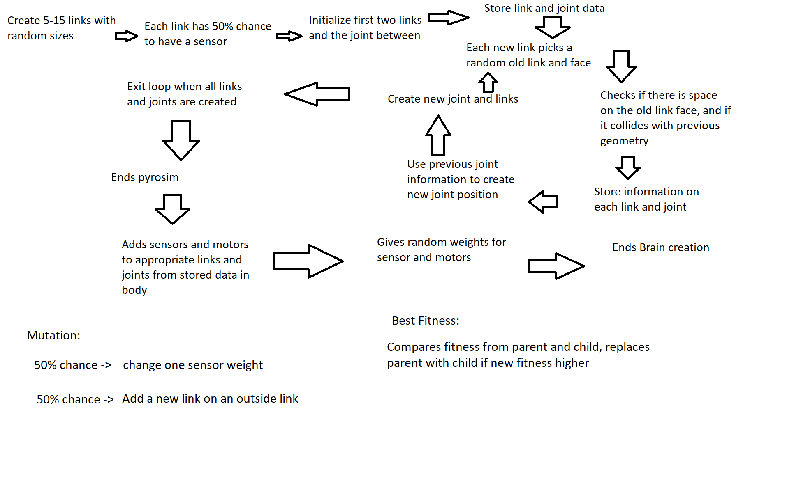
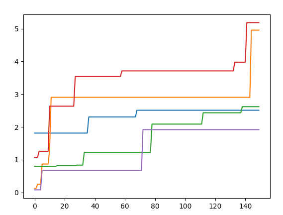

# mybots
repository for Ludobots Assignment 8
Jeffrey He

Run main.py to start the code.

Assignment 8

Body/Brain Generation and Mutation:

Body generation:
A random amount of links gets generated between 5-15.
Each link can is randomly chosen to be a sensor with a 50% probability.
Each link has its x,y,z dimensions stored in a dictionary randomly between 0.2 and 1.2.

For each new link, it creates a joint between a randomly selected old link. Then a randomly selected available face is selected on that link.

The code checks if there is a possible face for the link, and then collision detection is run so that the new link does not exist in the same space as an old link.

When creating a new link and joint, previous link information is used to create the new joint position in joint_maker and the code iterates over every new link and then end pyrosim.

Brain Generation:
Use stored variables to create sensors for the appropriate links, and generate motors off the list of joints created in body generation.

The weights for the sensors and motors are chosen at random as well.

The creature fills 3d space by having the option to produce multiple links off the same link instead of one link per link. The limbs protrude into free space and anti-collision detection is recorded through having each links' relative position and making sure it doesn't collide.
Most of the work done is in solution, with most lines commented what they are trying to do.

Video: https://www.youtube.com/watch?v=AMnK1Trw2OM

Resources:
Pyrosim: https://github.com/jbongard/pyrosim
Ludobots: https://reddit.com/r/ludobots
