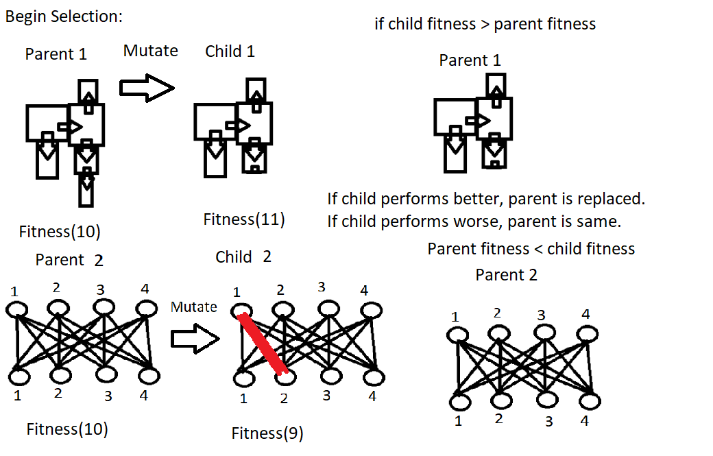
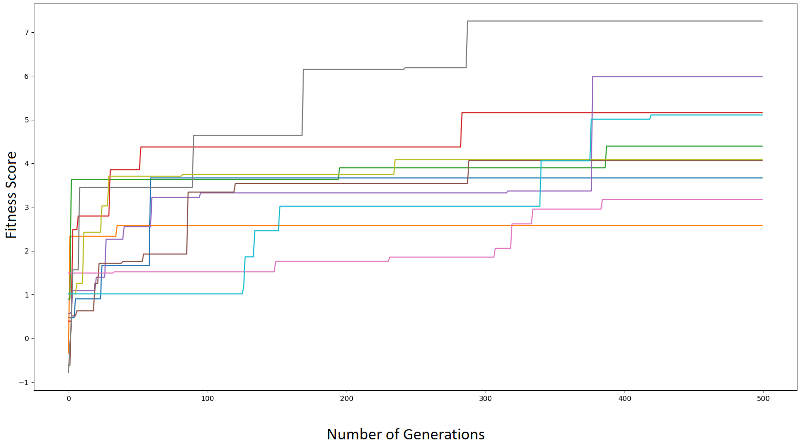

# Running Code
repository for Ludobots Assignment 8
Jeffrey He

Download all the files, and run main.py
At the command line: python3 main.py

# Videos

Short video: https://youtu.be/s92Cf5lF_S4

2 minute video: https://youtu.be/qfYji7_WTo0

# Methods
The simulation works through parallel hill climbing. Multiple robots are being modified simultaneously through creation, mutation, and selection. The image below shows a detailed version of robot creation.

ROBOT CREATION

First, the robot parameters are initiated with random number of links between 5-10. Each link has randomized size predetermined along with a 50% chance to be a sensor link. Then, the first 2 links and first joint are created manually, but still random. Next, every iteration a new link and joint gets attached to the previous robot. The code checks for self collision and only allows new links on outside faces. After all the links and joints are created, it gets formed and pyrosim ends.

For the brain, these are generated from mapping sensors to motors. Each sensor has a weight to a motor which can be changed later on to effect movement. 

After creation, each robot undergoes a mutation at each generation shown in the image below.

There are two possible mutations: either deleting an existing link, or changing a weight. Deleting a link removes an outside link and the joint attached to it. These only apply to the very outside link otherwise the robot breaks down. Changing the weight is done by changing a certain weight randomly in the array.

After mutation, the robot gets compared to its predecessor through selection and evolution shown below. 

In order for robots to change, there must be a criteria to compare in performance. This is called fitness. When a parent robot mutates and has a child robot, the fitness is compared between the two to see which is better. If the child is better, the parent gets replaced with the child robot. If the child is worse, the parent does not get replcaed and remains the same. The fitness of my robots is how far the robot moves in the x direction in around 10 seconds. Over many iterations and evolutions, the final parent robot may be very different from its initial robot.

# CODE OVERVIEW

The code runs from main.py which directly calls search.py. In search.py an instance of parallel hill climbing is initiated using the constants in constants.py. This parallel hill climbing evolves with the initiated parents over a certain number of generations. The end result is displaying the best robot along with a graph of fitness of each parent. 

The parents are stored through dictionaries of link information, joint information, size information, and many more. There are more dictionaries used to record instances of available link spaces on the robot as well as storing the relative position of each robot. To speed up simulations, the hard coded dimensions of the robot are not stored, but instead the relative space they are stored. This works for almost every case except when very small and very large blocks are near each other which is limited given the size constraints given. 

Simulation.py and simulate.py work with the robot and the data. The robot data is passed to robot.py which gives more commands to motor.py and sensor.py. When the simulation is done, robot.py gives the fitness data which gets stored in parallelhillclimber for future evolutions. The robot fills 3d space by giving the option to produce multiple links off the same link instead of one link per face.

To make modifications, mainly change populationsize and number of generations in constants.py. The fitness plot of 10 random seeds was conducted by recording the most fit parent from 1 run of 10x500, and then graphing all 10 best parents over 50,000 simulations.

# Results

Below is the fitness diagram of the 10 best parents per seed.

Fitness Diagram:
10 random seeds were ran with 10 parents over 500 generations. the best seed for each parent was recorded and a fitness plot was reran with the 10 best parents over 50,000 simulations.

On an overall scale, the results of my phc was somewhat disappointing. The robot failed to move extrememly far from the origin given the circumstances. There was visible growth over the larger amount of iterations, however, it was never at the point where it was running away. This can mainly be attributed to the minimal mutation procedures. Only deleting a link and modifying a sensor weight was available, as adding a link was not implemented at the moment. Given more time, further reserach would be done in seeing how drastic of an increase in fitness could be obtained by having the opportunity to add a new link to the outside of the robot.

Bodies somewhat reduced in size when examined, however, it would never go below 4 or 5 as those evolutions tended to be negative towards fitness. It seems after the first 100 generations, the robots got stuck over very long periods of time. This may be due to having already tried removing all the outside links available that give larger fitness changes being committed. When comparing early robots to their later counterparts, a majority of the time the only changes were the sensor weights.

# Resources:
Pyrosim: https://github.com/jbongard/pyrosim
Ludobots: https://reddit.com/r/ludobots
